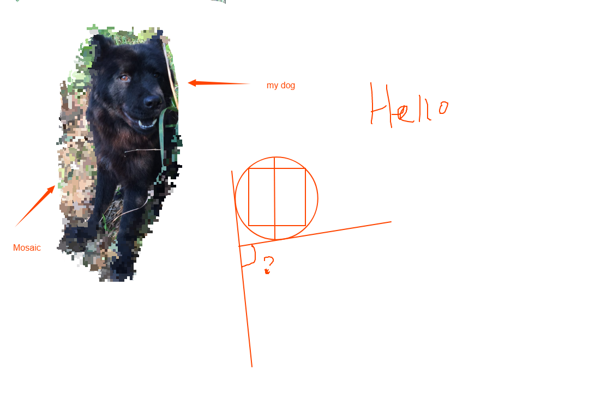

# canvas-drawing-board


Javascript drawing board based on canvas


## Install

```js
npm install canvas-drawing-board
```

or

```js
<script src="https://cdn.jsdelivr.net/npm/canvas-drawing-board@latest/dist/canvas-drawing-board.js"></script>
```

## Usage

```html
<!-- this div need set width and height (inline or css) and position: relative-->
<div id="app" style="position: relative; width: 800px; height: 600px"></div>
```

```js
import Board from 'canvas-drawing-board'

const board = new Board({id: "app"})
board.on('change', (data) => {
  // do something interesting！
})
```


## Constructor

| Attribute  | Description  | Default |
|-------- |-------- | -------- |
| id | placeholder | none |
| background | background color | #fff |

## API

- clear (清空画布):
board.clear()
- set pencil mode (default) (设置铅笔模式):
board.setModel('pencil')
- set eraser mode (设置橡皮擦模式):
board.setModel('eraser')
- set mosaic mode (设置马赛克模式):
board.setModel('mosaic')
- set pencil size (设置铅笔大小):
board.setSize(number)
- set pencil color (设置铅笔颜色):
board.setColor('#999')
- fill (填充画布):
board.fill(); // the fill color is based on pencil color
- history (历史 前进 和 后退):
board.prev()
board.next()
- import image (导入图片):
board.image.importImage()
board.image.importImageByBase64(base64 data)
- backup in localstorage (缓存画布到本地):
localStorage.setItem('backup', board.getBase64())
- restore backup (恢复缓存):
board.image.importImageByBase64(localStorage.getItem('backup'))
- download (下载当前图片):
board.download({
name: 'name',
type: 'png | jpg'
})
- draw circle (画圆):
board.polygon.addCircle(board)
 - how to use? 
 first, you press down the left mouse on the board
 then, drag the mouse, this can change the size of the circle
 finally, Release the lefe mouse, done
 - 怎么画？
 首先，在黑板上按下鼠标左键
 然后，拖动鼠标，这样就可以改变圆圈的大小
 最后，松开鼠标左键，完成
- draw rect (画四边形):
board.polygon.addRect(board)
- add text (添加文字):
board.text.addText(board)
- draw a straight line (画直线):
board.polygon.addLine(board)
- draw arrow (画箭头):
board.polygon.addArrow(board)
- resize
board.resize()

## Example




